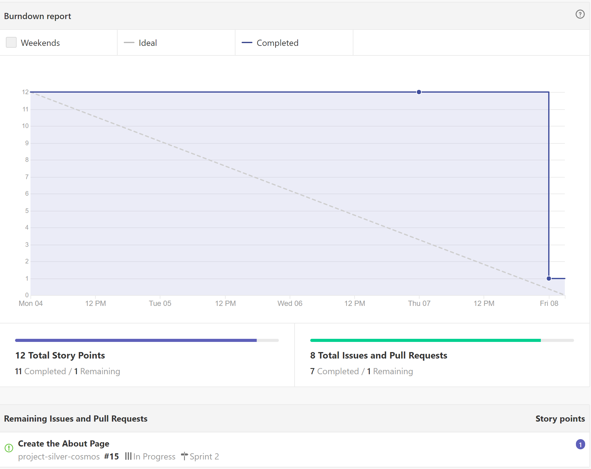

# 2019-11-08
## Burndown Chart

## Sprint Completed Stories

## Backlog

## Narrative - Sprint 2 Summary
In this abbreviated sprint, we were able to start making progress on Thursday (10/31). During our sprint planning meeting, we decided the scope of our sprint should be around DevOps and creating our initial deployment. 

We completed four buckets of tasks (some which are able to be parallelized):
1. Setting up our local development environments
2. Creating our Heroku site
3. Creating our project site
4. Testing Git

Creating our local development environment presented a few challenges. Our team members had to install Postgres and configure the DATABASE_URL key. Some members are still completing the task. We are using three different operating systems (MacOS, Windows, Linux), which presents some challenges. 

Graham deployed our site to Heroku, and added each individual as a collaborator. Initially, our build was failing because we hadn't installed a postgres plugin. After installing it, we were able to deploy our site.

We each were able to add branches successfully to our git repo, which we can see below.

## Narrative - Sprint 3 Preview
For Sprint 3, we will tie up any loose ends on the front end development (e.g., About page) and work on a majority of the back end development. We will also work on standing up an anaytics package for our webpage so that we are prepared to start observing how customers (bots) interact with our page when traffic hits our site. 

[Home](index.md)
