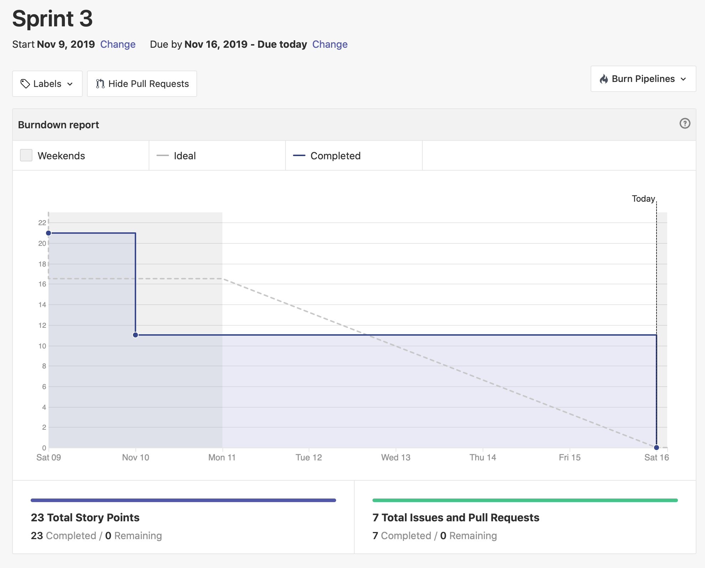
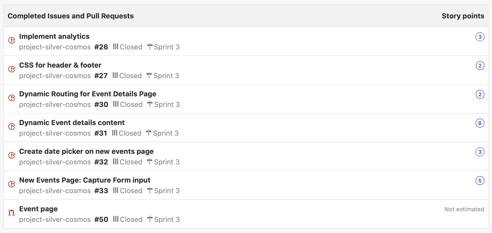
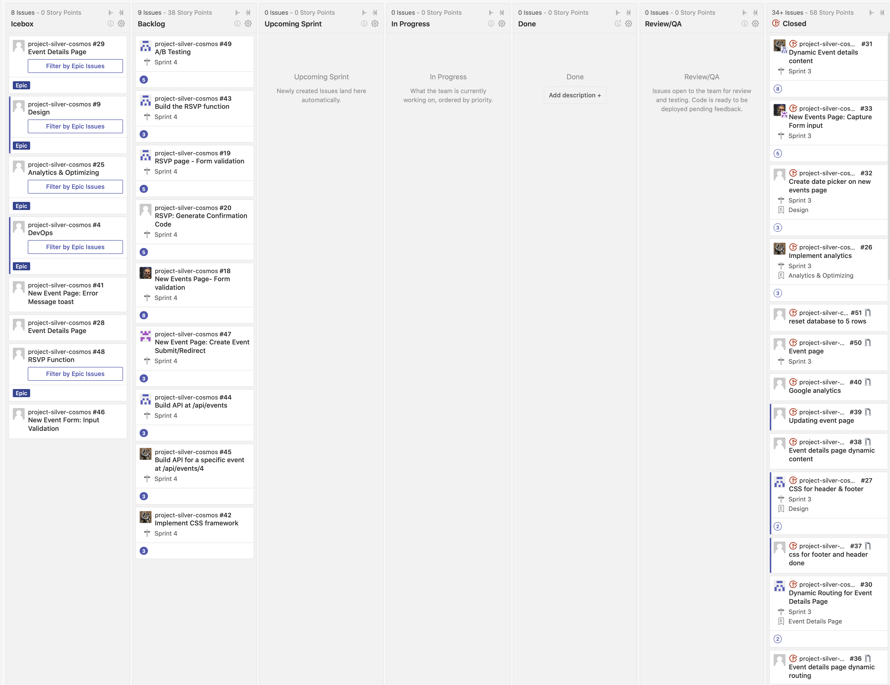
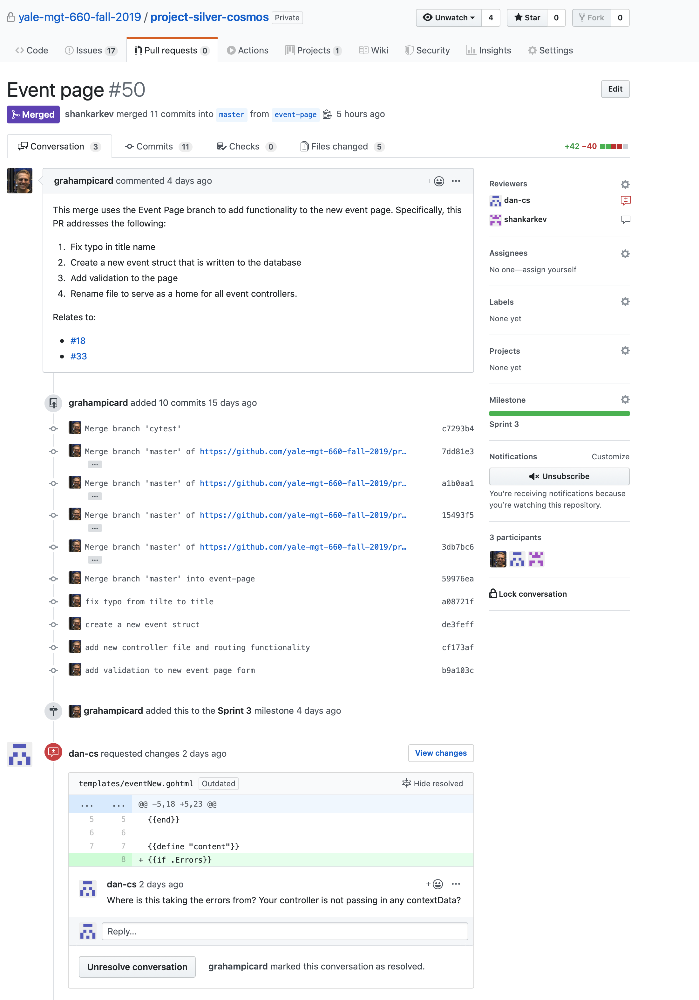
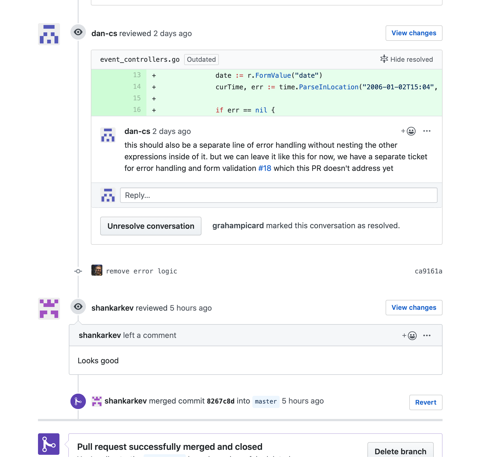
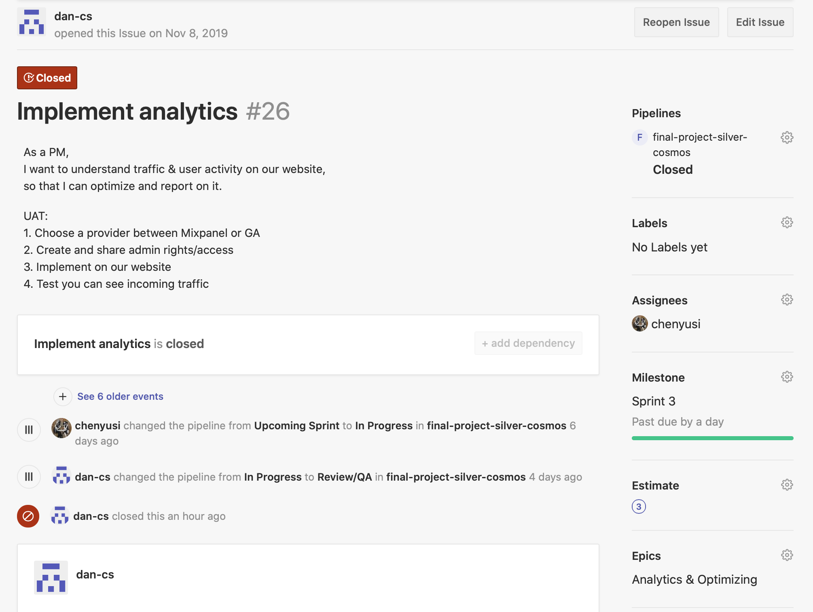

# 2019-11-16
## Burndown Chart

![2019.11.16 actual completion of stories(assets/Screen Shot 2019-11-16 at 4.56.45 PM.png)

## Sprint Completed Stories

## Backlog

## Narrative - Sprint 3 

### Goals
The key objectives (Must-do’s) for this sprint were making the ’New Event’ and ‘Event details’ page functional as well as to implement Google Analytics.
First, we felt that by having a “New Event’ page, where users could actually submit events and then an 'event details' page where users could actually find events we were practically reaching an MVP. To achieve this, we ensured that we had dynamic routing based on event IDs in the URL, the html would update based on context Data being passed in about an event and that we had the right functions to query the database for all the event Details. This also included creating a new table to store attendees. Whilst not formally a requirement, when designing the database, we ensured data integrity, by implementing database-level data validation, in case new, future applications would plug into our database that might not (or forget to) implement data validation at the back-end and/or front-end layer. This included checks for @yale.edu email addresses as well as a limitation for every email address to only RSVP to an event once. We also built out the POST request, enabling users to submit new events and storing these in our database. 
Second, rather than go further in developing features such as form validation or CSS, we decided to pursue an analytics implementation. Given we had an MVP up, it felt important to start gathering data as soon as possible on our users to help guide our development priorities and business decisions. For simplicity of implementation and widespread adoption we chose to use Google Analytics, however this decision was left up to the developer implementing the story to foster autonomy and research.

### Achievements
After a brief retrospective after our 2nd sprint to check in on everyone’s happiness and developmental goals it seems we have been able to maintain motivation, improve our collaboration and refine our processes. Our sprint planning sessions have moved earlier into the previous week with the incoming PM preparing stories already to save precious time spent together. We also feel our estimates are getting better and more aligned as we are learning. Importantly, we have been able to complete all stories in our sprint and have had a very consistent completion of stories (burndown) through the sprint. Unfortunately, this is not visible from our burndown chart (but can be seen in the dates of our PR merges) as it appears Zenhub does not close stories (‘issues’) when linked PRs are merged but considers these separately from each other. Thus to make the burndown chart reflective of our actual work we will in the future make sure to move stories in Zenhub to complete in parallel with PRs being merged. Finally, our velocity has increased from 12 to 23 points, which could be due to point inflation but in this case is truly due to more and more complex work being done in this sprint as we got familiar with the code and improved our skills. 

## Philosophy
### 1. Story Content
* Originally (in our second sprint) we started off with all pure front-end stories, creating 4, so everyone could do one of them. This served a double purpose. First giving us all exposure to the FE code-base as well as easing our way into the project as we deemed this to be the simplest tasks.
* Then in this sprint, we did the same for the back-end, where we needed to modify routes, controllers and database queries to allow everyone to go a layer deeper and become familiar with the entirety of the codebase and logic 
* During all this we did our best to keep stories as small as possible and break them up into independent small chunks that could be developed by different people in parallel or sometimes in sequence, creating more manageable pieces and enabling more sharing of work and knowledge

### 2. Collaboration & Learning
* Once everyone had gotten some exposure to both parts through the first two sprints, we had both FE, & BE stories this sprint
* In terms of allocation we continued our focus on educational value and exposure for everyone at a more granular level
* In particular people who hadn’t worked on an SQL related piece yet, would now do so
* To facilitate cross learning, productivity and experience sharing we additionally introduced pair programming both in person and remotely
* Our philosophy was to pair someone who was new to working on a deeper back-end story (like SQL) with someone who - through the previous sprint -or prior experience  had gotten exposure to that. We also considered which page each of us had worked on, in particular the two heaver lifts, the “New Event” page and the “Event details” page. In this occasion instead of also mixing that up for educational purposes we decided it was more sensible to pair someone who had worked on the “event details” page already (experienced) with the developer who would now be taking on a deeper back-end task for the first time related to that page so we could better rely on already built experience from the previous sprint. 
* Finally, to round off the educational component we were very thoughtful about our code reviews too, making sure that PRs were reviewed by members of the team who wanted to learn about the implementation of a particular feature. This also ensured the code was reviewed by someone who wasn’t working on the code yet, thus providing the most exacting review of the code.

## Best Practices
* **Local Environments:** all our teams are set up with a full local environment so development can happen at any time offline
* **Branching:** All stories are developed on independent branches 
* **Pull Requests:** Once stories are considered done by the developer we issue PRs which have to be approved by other team members
* **Minimal, supportive documentation:** Each PR had links to the original stories from our backlog as well as an explanation by the developer of her aims and approach to ease the review. Where applicable additional info (like a Google Analytics login/API key) were provided to streamline the review
* **Code Reviews:** Code reviews are done by other team members and utilize both general comments and feedback as well as line-by-line comments

* **Merging of master:** All PR owners merged the latest master branch into their branch before issuing a PR and resolved conflicts
* **Retrospective:** We did a brief retrospective after our 2nd sprint to check in on everyone’s happiness and developmental goals to maintain motivation, improve our collaboration and continuously refine our processes
* **Epics:** tie together related stories in our backlog such as “Analytics & Optimization” or “Design improvements"
* **Scrum Agile:** We have a well prioritized and estimated backlog at the beginning of each sprint with stories assigned to developers in a self-organizing fashion
* **Stories:** Stories are written in a consistent format of: As a …, I want to…, so that.. . Stories also contain User Acceptance Criteria and on occasion some technical guidance although this is mostly left to the developer working on the story

## Sprint 4 Preview
For sprint 4, we will focus on implementing A/B testing so as to gather the most possible data before our report deadline to the business. Following that our key priority is enabling RSVP-ing to events, which is the last core functional component missing. Once that is done we are planning to build out our APIs and Form Validation.
