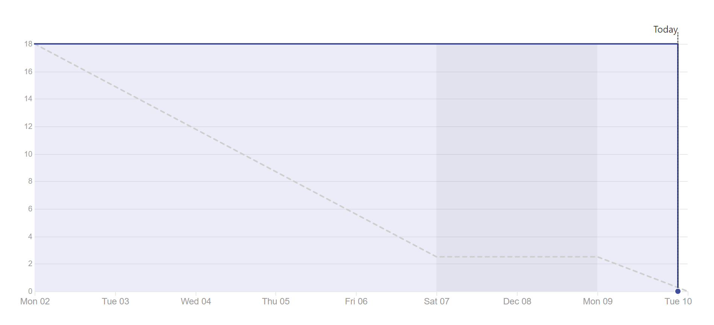
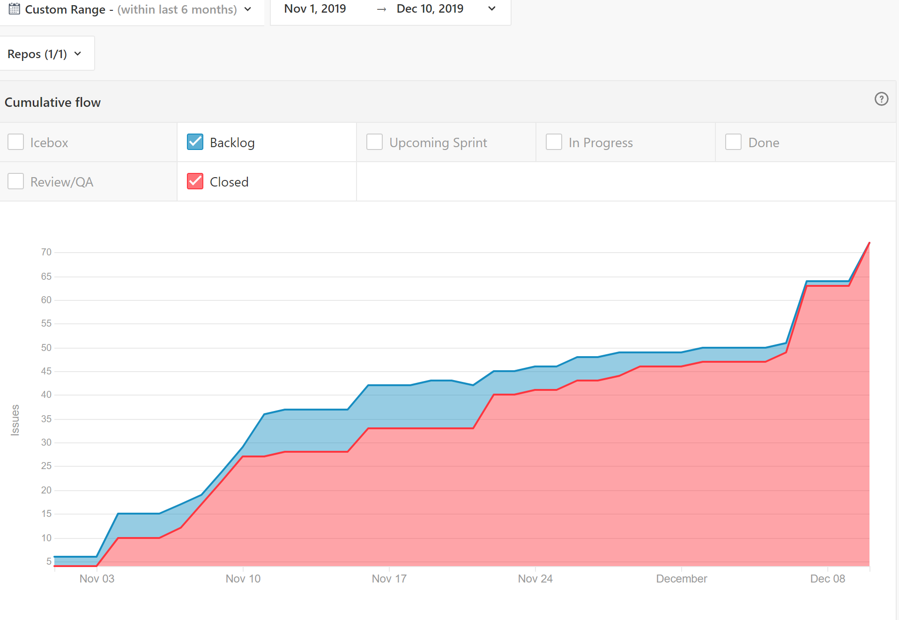
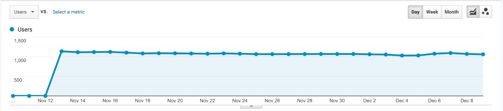
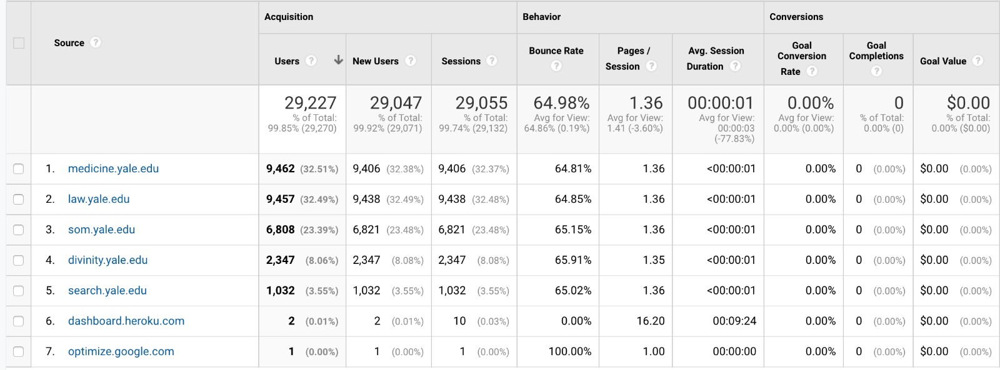
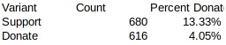

# 2019-12-10(Final)
## Final Sprint Burndown Chart

## Cumulative Burnup Chart

![12-10-2019 Cumulative Burndown Chart] (assets/Cumulative Burndown 12-10-2019.PNG)

## Overall Velocity
![12-10-2019 Overall Velocity] (assets/velocity.png)
Among our 5 weekly sprints, Sprint 4(November 16-22) is most productive, with far more higher than average completion of stories (38/40 points). The only 2 left was CSS touchup.

![12-10-2019 Cumulative Burndown Chart] (assets/difficulty.png)
Overall, the epics taking longest time for us are "Building RSVP functions", "API implementation", and "CSS". 
![12-10-2019 Cumulative Control Chart] (assets/controlchart.png)

## Narrative - Final Sprint Report

### Goals
The key objectives (Must-do’s) for this sprint were making putting the finsihing touches on our web page and making sure the site passed all of the grading code criteria.

### Outcomes

## Traffic analysis
 

Daily referral traffic starting Nov 12 is around 1,080. Up till December 9, 2019,  99.9% of traffic are through referral, among which the distribution are depicted as below:

![Image 2 traffic analysis] (assets/image 2 traffic analysis.jpeg)

Most traffic was directed from “http://medicine.yale.edu/” and “http://law.yale.edu/”, each sharing 32.5%, followed by “http://som.yale.edu/”(23.4%). “http://divinity.yale.edu/” referred 8.1% of all traffic, while “http://search.yale.edu
” contributed only 3.5%.

Top 5 referrers shared similar bounce rate, pages/ session as well as session duration. 

## A/B testing
Until 12/09, as can be seen from our database, “Support” has a click rate of 13.33% while “Donate” has a click rate of 4.05%, indicating “Support” is more effective.

(Text of button is programmed to display equal likelihood- “Support” and “Donate” show alternatively as refreshing the page. Therefore counts/impressions for the 2 buttons are similar.)

## Refactoring code
We spent time to refactor our code to reduce possible errors that would come from data structures defined multiple times. In doing so, we were able to create functions that do one thing well, and reused them accordingly throughout the project.

## Pass tests
Passed 100% tests. 

## Unit tests
In addition to the tests from the grading site, we added our own unit tests to ensure that database connections were flowing smoothly, and that no invalid data could be added to our database. We also added unit tests to ensure pages wouldn't break when refactoring code. 

### Lessons Learned
- Start early
- Check-in with teammates who may be struggling
