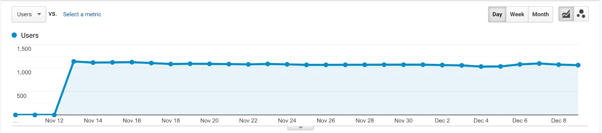

# 2019-12-10
## Final Sprint Burndown Chart

## Cumulative Burndown Chart

![12-10-2019 Cumulative Burndown Chart] (assets/Cumulative Burndown 12-10-2019.PNG)

## Narrative - Final Sprint Report

### Goals
The key objectives (Must-do’s) for this sprint were making putting the finsihing touches on our web page and making sure the site passed all of the grading code criteria.

### Outcomes

## Traffic analysis
 

Daily referral traffic starting Nov 12 is around 1,080. Up till December 9, 2019,  99.9% of traffic are through referral, among which the distribution are depicted as below:

![Image 2 traffic analysis] (assets/image 2 traffic analysis.jpeg)

Most traffic was directed from “http://medicine.yale.edu/” and “http://law.yale.edu/”, each sharing 32.5%, followed by “http://som.yale.edu/”(23.4%). “http://divinity.yale.edu/” referred 8.1% of all traffic, while “http://search.yale.edu
” contributed only 3.5%.

Top 5 referrers shared similar bounce rate, pages/ session as well as session duration. 

## A/B testing
Until 12/09, as can be seen from our database, “Support” has a click rate of 13.33% while “Donate” has a click rate of 4.05%, indicating “Support” is more effective.

(Text of button is programmed to display equal likelihood- “Support” and “Donate” show alternatively as refreshing the page. Therefore counts/impressions for the 2 buttons are similar.)

## Refactoring code

## Pass tests

## Unit tests (made our own tests to make sure database was working and changes would not mess up database)

### Lessons Learned

